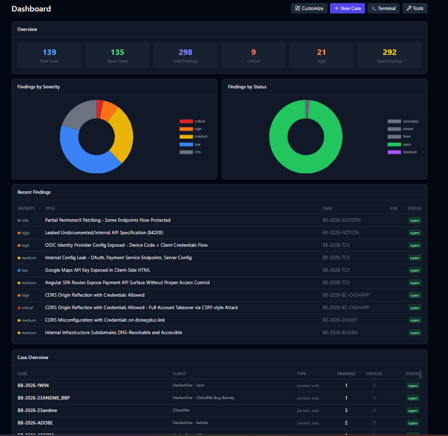
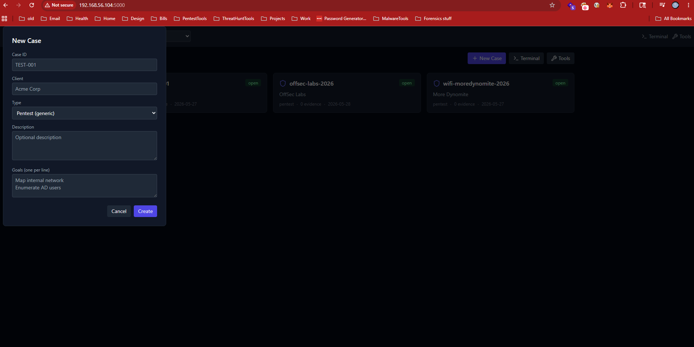
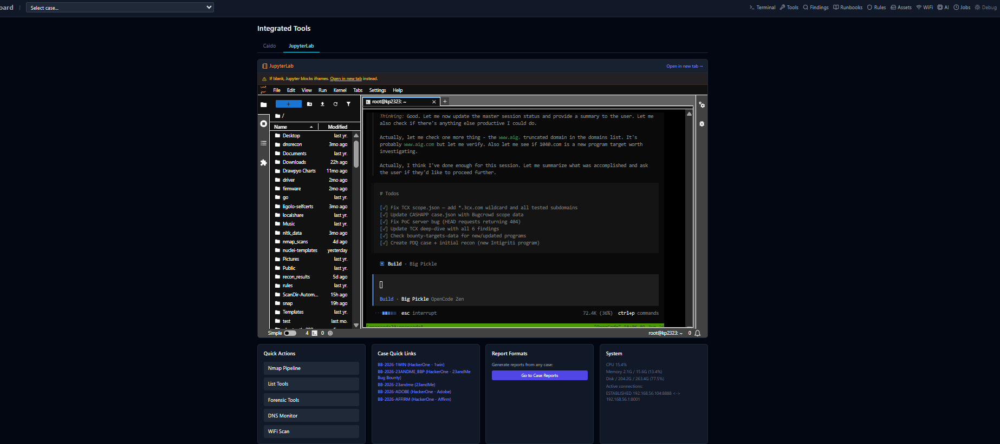
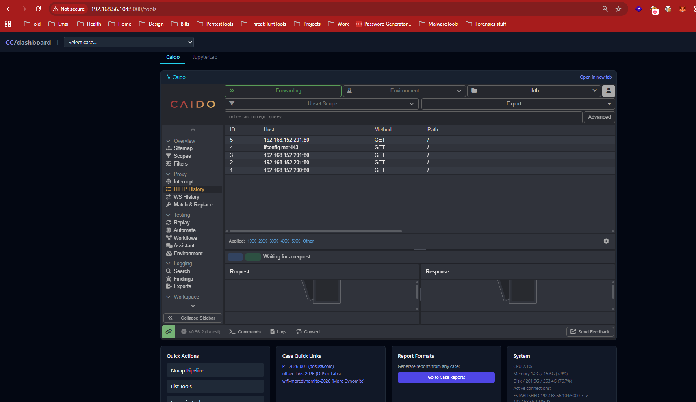
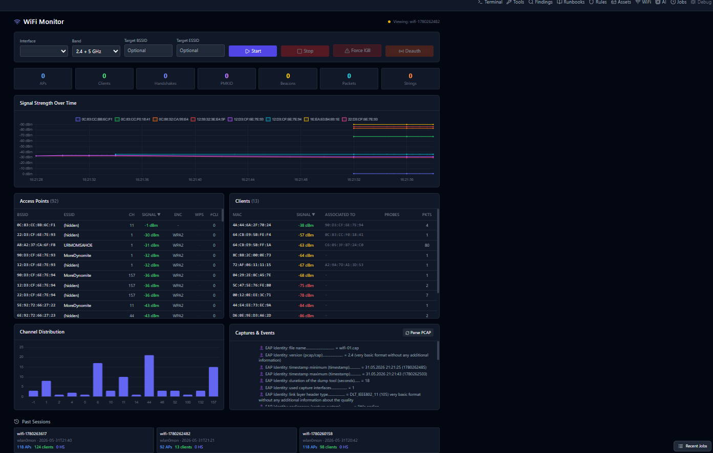
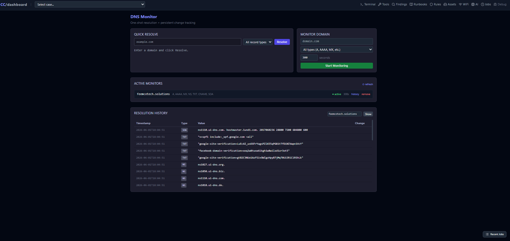
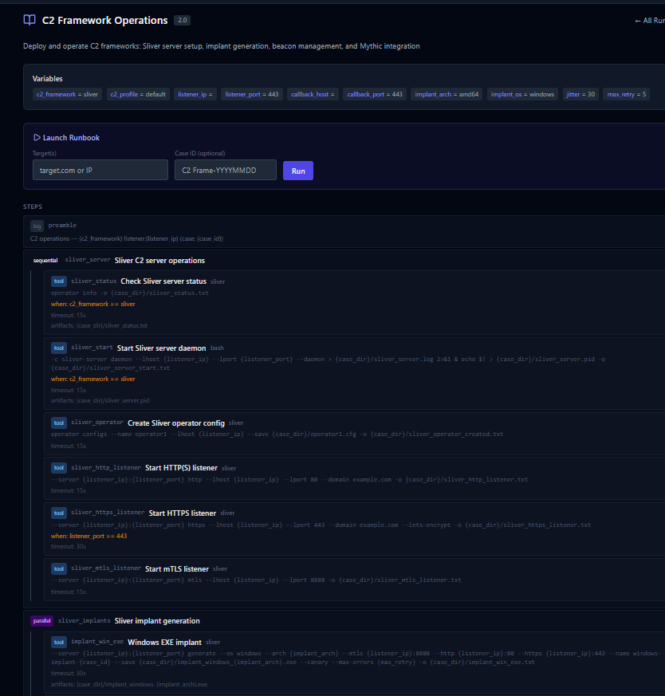
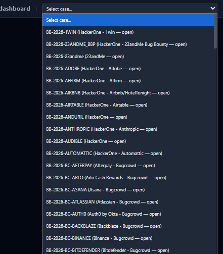
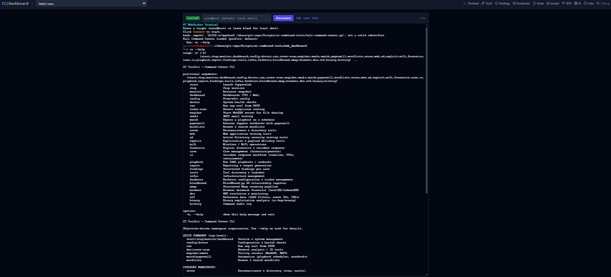

# CC Toolkit

An open-source penetration testing command center — web dashboard, CLI, and MCP server for orchestrating security assessments. This was started from many scripts that I had put together in one tool, expanded with ai to give a pretty little dashboard and what not. My version is running with some custom locations for various things, and i don't know that it's useful to anyone, but hopefully it can be. 

> **Status**: Active development. This is a cleaned, public version of a battle-tested internal toolkit.

---

## Quick Start

```bash
# Clone & setup
git clone https://github.com/feemcotechnologies/cc-toolkit.git
cd cc-toolkit
pip install -r requirements.txt

# Start web dashboard
python run.py web          # → http://localhost:5000

# Or CLI/TUI
python run.py cli

# Or MCP server (for AI assistant integration)
python run.py mcp
```

### Docker

```bash
docker compose up -d       # → http://localhost:5000

# With Jupyter
docker compose --profile with-jupyter up -d
```

---

## Screenshots

<table>
  <tr>
    <td width="50%"><br><em>Main dashboard — stats, charts, recent findings</em></td>
    <td width="50%"><br><em>New case creation form</em></td>
  </tr>
  <tr>
    <td width="50%"><br><em>Tools page with JupyterLab iframe</em></td>
    <td width="50%"><br><em>Tools page with Caido proxy iframe</em></td>
  </tr>
  <tr>
    <td width="50%"><br><em>WiFi monitoring — signal graphs, AP list, handshake capture</em></td>
    <td width="50%"><br><em>DNS resolution & change tracking</em></td>
  </tr>
  <tr>
    <td width="50%"><br><em>Runbook library — 40 YAML playbooks</em></td>
    <td width="50%"><br><em>Runbook editor with step configuration</em></td>
  </tr>
  <tr>
    <td width="50%"><br><em>Case selector dropdown — quick switch between engagements</em></td>
    <td width="50%"><br><em>WebSocket terminal — local or remote SSH</em></td>
  </tr>
</table>

---

## Architecture

```
cc-toolkit/
├── run.py                  # Unified entry point (web | cli | mcp | shell)
├── cli.py                  # Interactive CLI/TUI (ncurses-based)
├── cc_mcp_server.py        # MCP server for AI assistant integration
│
├── modules/
│   ├── config.py           # Configuration (env vars → defaults)
│   ├── case_manager.py     # Case lifecycle (create, update, close)
│   ├── findings_db.py      # Findings storage & query
│   ├── playbook_engine.py  # YAML playbook execution engine
│   ├── tool_wrappers.py    # ~100 orchestrated security tools
│   ├── nmap_wrapper.py     # Nmap scan orchestration
│   ├── wifi_monitor.py     # Live WiFi monitoring (airodump-ng)
│   ├── wifi_wrapper.py     # WiFi attack tools (evil twin, deauth, etc.)
│   ├── asset_tracker.py    # Encrypted credential vault
│   ├── report_generator.py # HTML/Markdown/DOCX/PDF report generation
│   ├── obsidian_bridge.py  # Obsidian vault export
│   ├── remote_runner.py    # Remote command execution (SSH)
│   ├── ws_terminal.py      # WebSocket terminal server
│   ├── job_queue.py        # Async job manager with SSE
│   ├── kerberos_tools.py   # Kerberos attack tooling
│   ├── rules_manager.py    # Custom Sigma/YARA/Semgrep rule mgmt
│   ├── bin_wrapper.py      # Binary exploitation tooling
│   └── ...                 # And more
│
├── web_dashboard/
│   ├── app.py              # Flask web app (50+ routes)
│   ├── templates/          # Jinja2 templates
│   └── static/             # JS/CSS assets
│
├── playbooks/              # 40 YAML playbooks
│   ├── webapp-scan.yaml
│   ├── linux-privesc.yaml
│   ├── bloodhound-ad.yaml
│   └── ...
│
├── Dockerfile              # Multi-stage Docker image
├── docker-compose.yml      # Compose with optional Jupyter
└── requirements.txt        # Python dependencies
```

---

## Configuration

All settings are controlled via environment variables with sensible defaults:

| Variable | Default | Purpose |
|----------|---------|---------|
| `CC_WORKSPACE` | `/workspace` | Root data directory |
| `CC_HOST` | `0.0.0.0` | Dashboard listen address |
| `CC_PORT` | `5000` | Dashboard port |
| `CC_SECRET` | auto-generated | Flask secret key |
| `CC_JUPYTER_URL` | `http://localhost:8888` | Jupyter integration |
| `CC_CAIDO_URL` | `http://localhost:8080` | Caido proxy integration |
| `CC_OBSIDIAN_DIR` | *(unset)* | Obsidian vault for report export |
| `CC_COMPANY` | `Your Company Name` | Report branding |
| `CC_TESTER` | `Your Name` | Report tester name |

See `.env.example` for the full list. Copy it to `.env` and customize:

```bash
cp .env.example .env
# Edit .env with your preferences
```

---

## Features

### 🔍 Web Dashboard
- Case management (create, track, close engagements)
- Live findings database with filtering & bulk operations
- 40+ YAML playbooks with parallel execution
- Real-time job queue with SSE progress updates
- Integrated WebSocket terminal (local or SSH)
- WiFi monitoring with signal graphs
- Custom rules management (Sigma, YARA, Semgrep)
- Encrypted credential vault
- HTML/Markdown/DOCX/PDF report generation

### 📟 CLI/TUI
- Interactive ncurses-based dashboard
- Quick command execution
- System health checks
- Arsenal cheatsheet integration

### 🤖 MCP Server
- Exposes all toolkit functions as MCP tools
- Integrates with AI assistants (opencode, Claude, etc.)
- Playbook orchestration via AI

### 📡 WiFi Monitoring
- Live AP/client discovery via airodump-ng
- WPA handshake/PMKID capture
- Deauth attack to force handshakes
- Signal strength time-series charts
- Channel distribution visualization

---

## Playbooks

The toolkit ships with 40 ready-to-use YAML playbooks covering:

- **Web**: xss-scan, sqli-scan, cms-assessment, sast-scan, nuclei-scan
- **Network**: nmap-scan, service-enum, bloodhound-ad, kerberos-attacks
- **Cloud**: cloud-enum, s3-enum
- **Mobile**: mobile-pentest, api-assessment
- **Privesc**: linux-privesc, windows-privesc, password-audit
- **WiFi**: wireless-audit, evil-twin, handshake-capture
- **Custom**: playbooks are easy to write (see any .yaml for the schema)

---

## Development

```bash
# Install dev dependencies
pip install -r requirements.txt

# Run the test suite (when available)
python -m pytest tests/

# Check for common issues
python -m py_compile modules/config.py
python -m py_compile modules/*.py
```

---

## License

All things are up for grabs, but credit would be a nice to have. I didn't make it for credit, but I published it for it. lol

---

## Disclaimer

This tool is intended for authorized security testing only. Users are responsible for complying with all applicable laws. The authors assume no liability for misuse.
